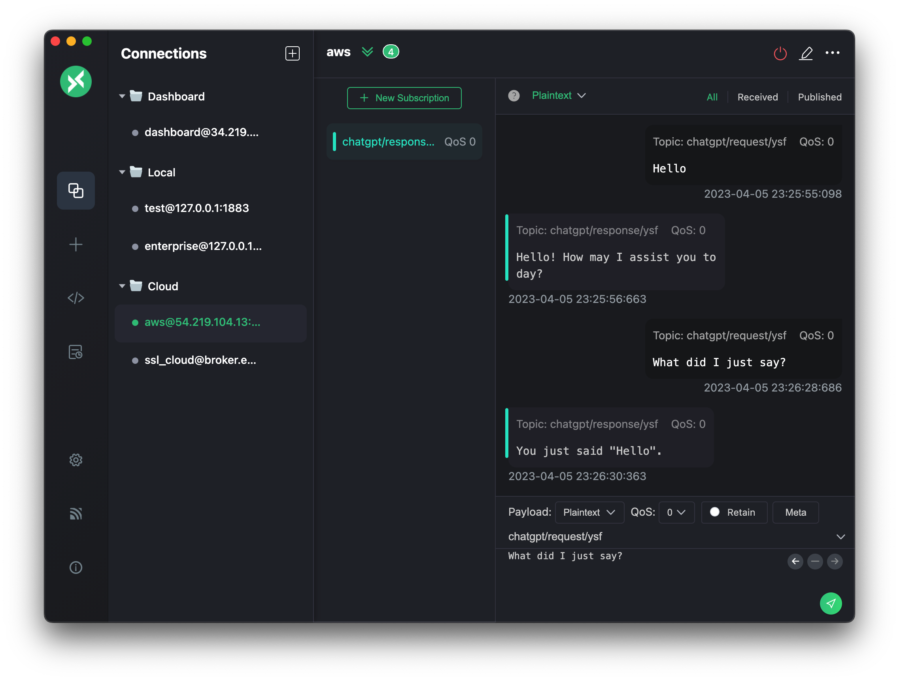

# openai-mqtt-nodejs

Node.js project that combines OpenAI's API with MQTT for real-time AI-driven interactions in IoT ecosystems.



## Description

This project aims to provide a simple and efficient way to integrate OpenAI's ChatGPT with MQTT protocol, enabling real-time AI-driven interactions within IoT ecosystems. By leveraging the power of OpenAI's language models, users can interact with their connected devices using natural language. This project is suitable for a wide range of IoT applications, such as smart homes, industrial automation, and other IoT domains.

## Getting Started

### Prerequisites

- Node.js and npm installed on your system
- An OpenAI API key
- An MQTT broker to connect to (e.g., EMQX, EMQX Cloud)

### Installation

1. Clone the repository:

    ```bash
    git clone https://github.com/your-username/openai-mqtt-nodejs.git
    ```

2. Go to the project directory:

    ```bash
    cd openai-mqtt-nodejs
    ```

3. Install the dependencies:

    ```bash
    npm install
    ```

4. Create a `.env` file in the project root directory with the following content:

    ```bash
    OPENAI_API_KEY=your_openai_api_key
    ```

5. Update the OPTIONS object in index.js with your MQTT broker's connection details.

## Usage

1. Start the application:

    ```bash
    node index.js
    ````

    or

    ```bash
    npm run start
    ```

2. The application will automatically connect to the MQTT broker and subscribe to the `chatgpt/request/+` topic.

3. To interact with the ChatGPT, publish a message to a user-specific topic like `chatgpt/request/user1`. The application will receive the message, send it to the OpenAI API, and publish the response to a corresponding topic like `chatgpt/response/user1`.

Each user should have their unique topic for requests and responses to ensure user isolation. Replace `user1` with an appropriate identifier for each user.

## Contributing

Contributions are welcome! If you'd like to contribute to the project, please follow the steps below:

1. Fork the repository.

2. Create a new branch with a descriptive name.

3. Commit your changes to the branch.

4. Push the changes to your fork.

5. Open a pull request with the main repository.

## License

This project is licensed under the MIT License. See the [LICENSE](https://github.com/ysfscream/openai-mqtt-nodejs/blob/main/LICENSE) file for more information.
